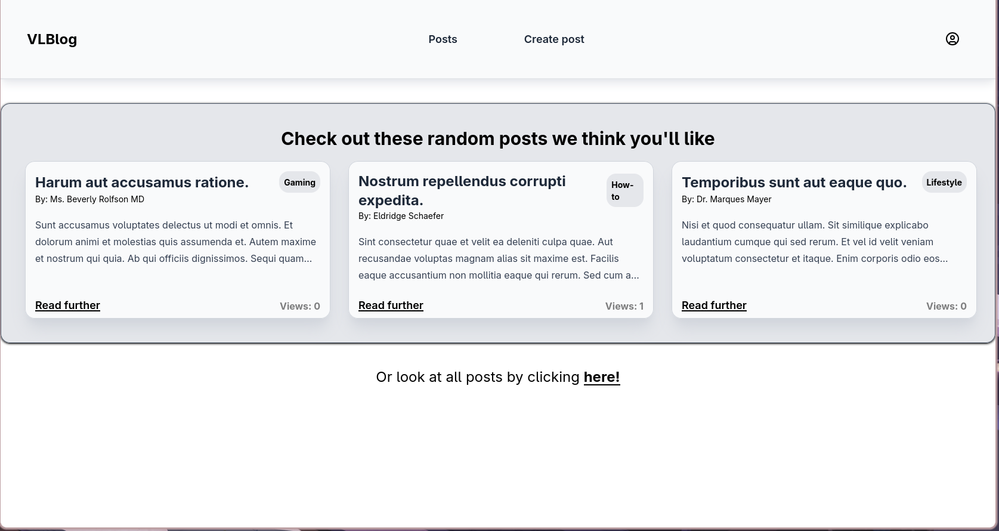
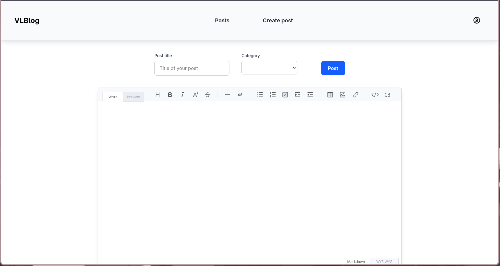
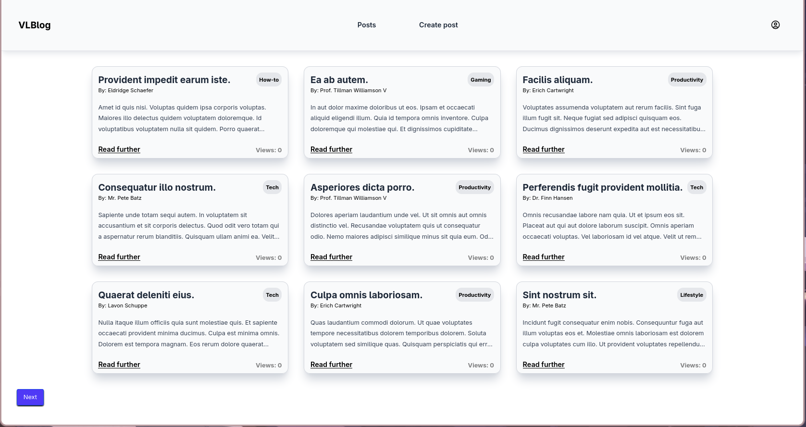

# VLBlog 

A basic blog practice project I made in Laravel and Vue.

 
 
 

## About/Features
Its a very basic implementation of a simple blog system. Using [Laravel](https://laravel.com/) for the backend, [Vue](https://vuejs.org/) for the frontend and [Inertiajs](https://inertiajs.com/) for the routing. 
 
 
The user can create posts, view posts, create an account and login. Each post has a views tab to see how many times a post has been viewed. A user themselves and users who are admins can delete their own/a post. The homescreen shows 3 random posts and a link to all the posts. 
 
 
The navbar is responsive and turns into a hamburger menu on smaller screens.
 
I use ToastUI for the create post editor this allows markdown and doubles as a WYSIWYG-Editor. 

##### Zoomed out to show whole page
 
 
 

## Technologies used

- HTML
- TailwindCSS (For the styling)
- Laravel (PHP)
- Vue (Javascript)
- Inertiajs (Routing)
- Toast UI (Create a post editor)

 
 
 

## To add
- Better styling/UI
- Comments
- Change login info on dashboard
- Sorting
- Filter on category
- Search bar